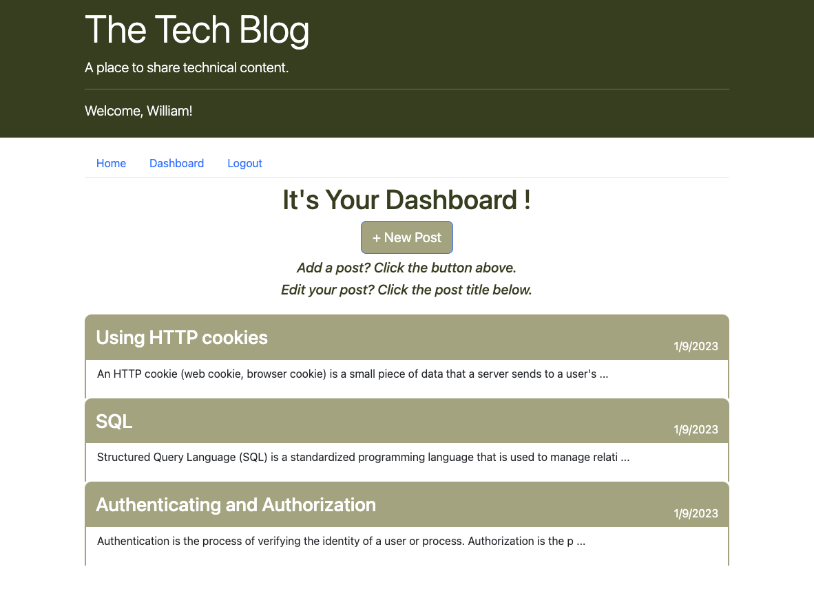

# Tech-Blog   

## Description
A CMS-style (Content Management System style) blog site, where developers can publish their blog posts and comment on other developers’ posts as well.

## Table of Contents
* [Deployed Application](#deployed-application)
* [Usage](#usage)
* [Built With](#built-with)
* [Screenshot](#screenshot)
* [License](#license) 

## Deployed Application

Here is the link [https://heidi-tech-blog.herokuapp.com](https://heidi-tech-blog.herokuapp.com) for the deployed application.

## Usage
- When you visit the website, you will see on the homepage all the existing blog posts, each with a title and a snippet.
- You can see the full content and the comments of a particular blog post by clicking the blog post title on the homepage.
- However, you have to login before you can leave a comment to other blog posts.
- Go to the Login tab to login.
- If you haven't had an account yet, you can sign up one from the Login page. (click 'signup' at the bottom of the Loggin page.)
- Once you are logged in, you can go to the dashboard to ADD NEW POST or eidt your existing blog posts.
- when you click the title of a particular blog post on your dashboard, you will be presented with a "Edit Post" page where you have the options to UPDATE or DELETE your blog post.

## Built With

- *MVC* architectural structure:
    - Front End (View):
        - *HTML*
        - *CSS*
        - *JavaScript*
        - *Bootstrap* as CSS framework
    - Back End (Controller):
        - *Node.js*
        - *Express.js*
        - *dotenv* for environment variables
        - *bcrypt* for password hashing
        - *Handlebars.js* as templating engine
        - *express-session* for authentication
        - *connect-session-Sequelize* for session store
    - Database (Model);
        - *MySQL*
        - *Sequelize* as the ORM
- Deployment
    - *Heroku*
    - *JawsDB* as cloud database

## Screenshot

Homepage - all blog posts with a title and a snippet:

Single post - full content and comments:

Login page:

Sign-up page:

Single post - after logged in, you have the option to leave a comment:

Dashboard:

Add new post:

Edit your post:

## License

 

This project is licensed under the terms of the MIT license.
